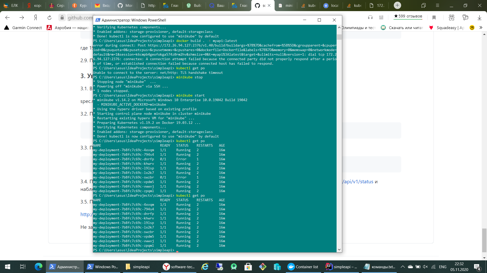
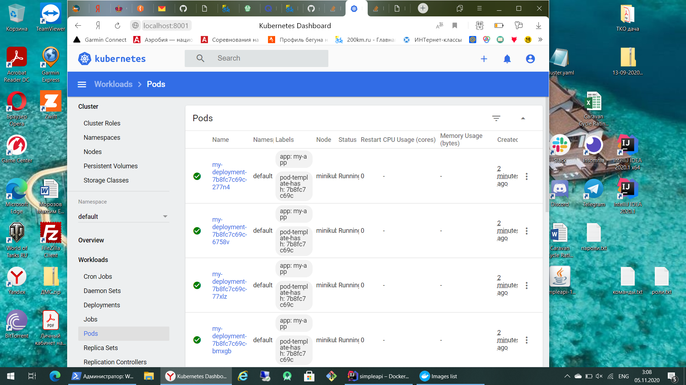

# Технология разработки программного обеспечения
# Лабораторная работа №2: создание кластера Kubernetes и деплой приложения
## Морозов Максим Евгеньевич, Группа 3МБД2001
## Цель лабораторной работы: 
Целью лабораторной работы является знакомство с кластерной архитектурой на примере Kubernetes, а также деплоем приложения в кластер.

Для настройки Kubernetes были применены два файла, первый deployment.yaml с кодом:

    apiVersion: apps/v1
    kind: Deployment
    metadata:
      name: my-deployment
    spec:
      replicas: 10
      selector:
        matchLabels:
          app: my-app
      strategy:
        rollingUpdate:
          maxSurge: 1
          maxUnavailable: 1
        type: RollingUpdate
      template:
        metadata:
          labels:
            app: my-app
        spec:
          containers:
            - image: myapi:latest
              # https://medium.com/bb-tutorials-and-thoughts/how-to-use-own-local-doker-images-with-minikube-2c1ed0b0968
              # указыаает на то, что образы нужно брать только из локального registry. В продакшене никогда не использовать
              imagePullPolicy:  Never 
              name: myapi
              ports:
                - containerPort: 8080
          hostAliases:
          - ip: "192.168.0.9" # The IP of localhost from MiniKube
            hostnames:
            - postgres.local
            
Второй Service.yaml с кодом:

    apiVersion: v1
    kind: Service
    metadata:
      name: my-service
    spec:
      type: NodePort
      ports:
        - nodePort: 31317
          port: 8080
          protocol: TCP
          targetPort: 8080
      selector:
        app: my-app

Результат вывода команды kubectl get po в PowerShell показывает, что деплой прошёл успешно и все 10 подов запущены и работают:

Такой же резутьтат видим через графический интерфейс:

